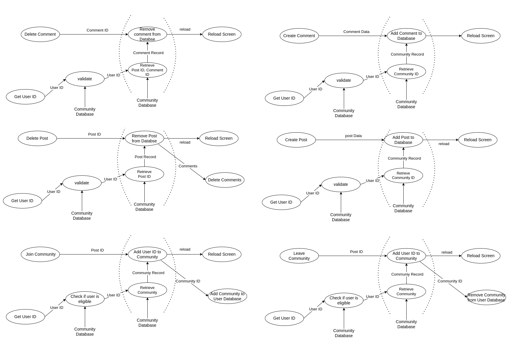
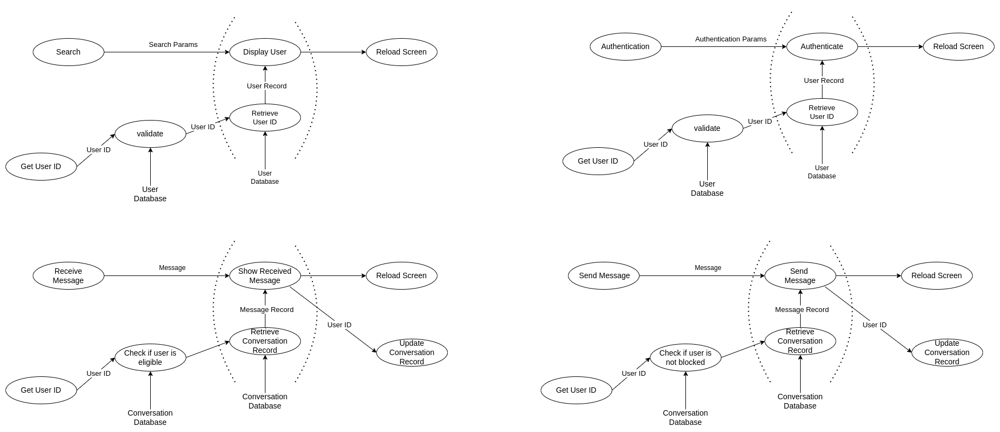
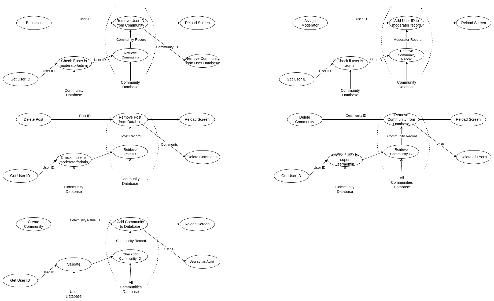
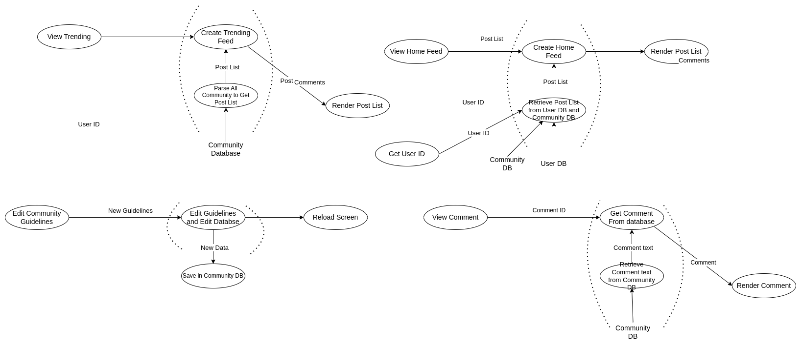
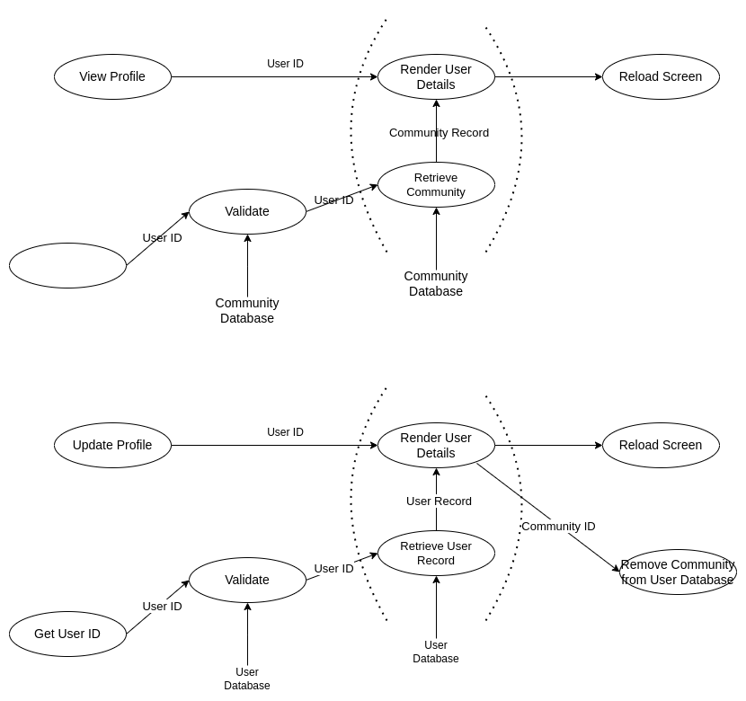
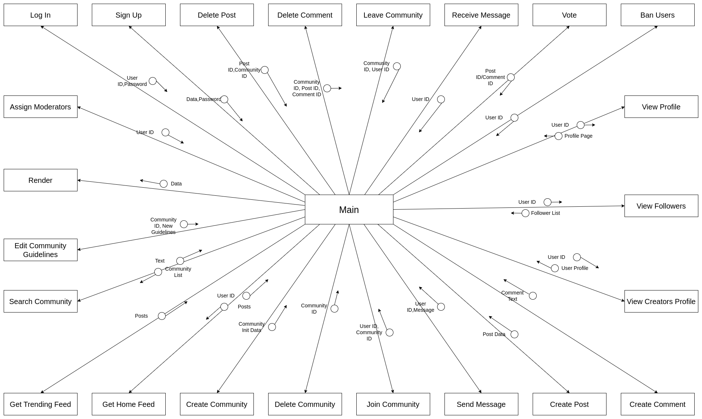
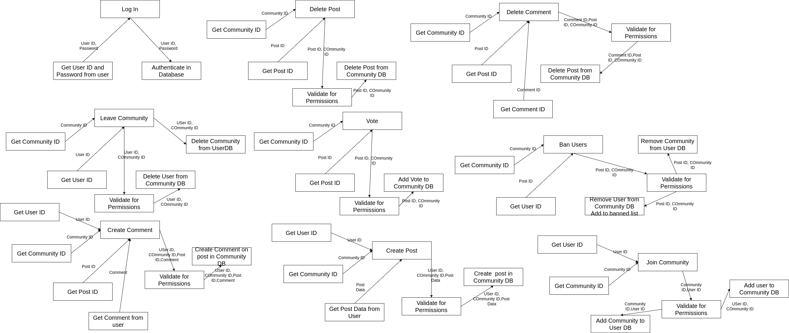
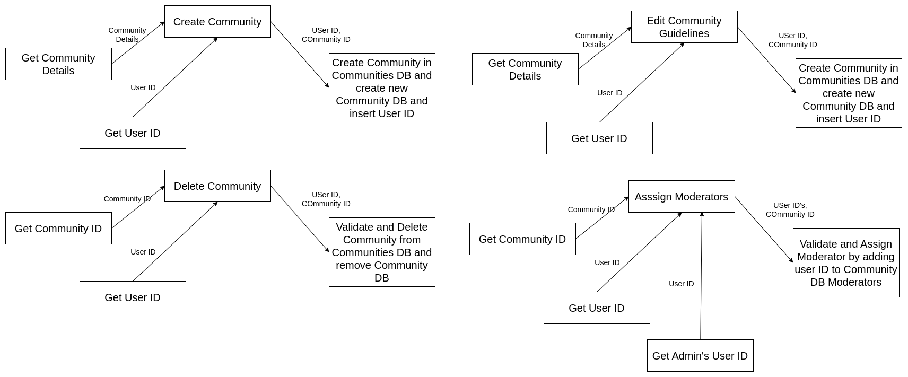
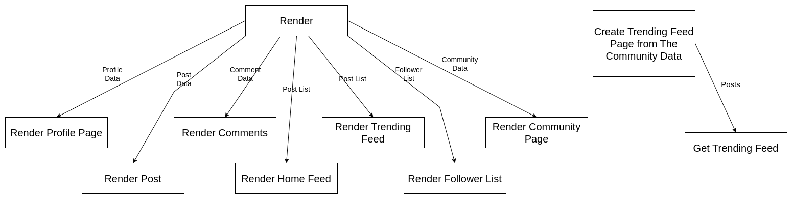
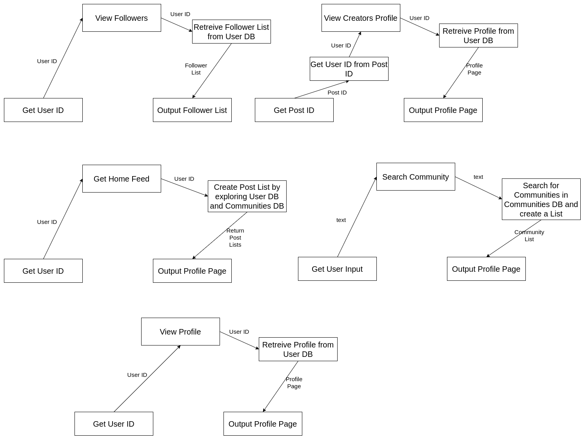

# Software Design

# Communities : A Social Media Platform(SM02)

- Harshit Pant(CS21BTECH11021)
- Satpute Aniket Tukaram(CS21BTECH11056)
- Mahin Bansal(CS21BTECH11034)
- Burra Vishal Mathews(CS21BTECH11010)

## Table of Contents

- [Software Design](#software-design)
- [Communities : A Social Media Platform(SM02)](#communities--a-social-media-platformsm02)
  - [Table of Contents](#table-of-contents)
  - [Overview](#overview)
  - [Data Flow Diagrams](#data-flow-diagrams)
  - [Structured Charts](#structured-charts)
    - [First Level Factored modules](#first-level-factored-modules)
    - [Factored input modules](#factored-input-modules)
    - [Factored output modules](#factored-output-modules)
    - [Factored Composite modules](#factored-composite-modules)
  - [Design Analysis](#design-analysis)
    - [All Factored Modules](#all-factored-modules)
    - [Most Complex Module](#most-complex-module)
    - [Top-3 Modules](#top-3-modules)
    - [LoC](#loc)
  - [Detailed Design Specification](#detailed-design-specification)

## Overview

- The project is a social media platform that allows users to create and join communities based on their interests.
- Users can create posts, comment on posts, and interact with other users in the community.
- The platform also provides a chat feature for users to communicate with each other.
- The platform also provides a feature to report inappropriate content and users.

\newpage

## Data Flow Diagrams

- The DFD represents the flow of data in the system through various inputs and outputs.

{ width=80%}

{ width=80%}

\newpage

{width=80%}

{width=80%}

\newpage

{width=80%}

- The MAI and MAO can be seen in the DFD highlighted by dotted lines.

\newpage

## Structured Charts

### First Level Factored modules

{ width=80% }

### Factored input modules



\newpage



### Factored output modules



\newpage

### Factored Composite modules



\newpage

## Design Analysis

### All Factored Modules

| Module Name           | Type      | Cohesion type | Estimated Size |
| --------------------- | --------- | ------------- | -------------- |
| Log In                | Input     | Sequential    | 100            |
| Delete Post           | Input     | Sequential    | 400            |
| Delete Comment        | Input     | Logical       | 100            |
| Leave Community       | Input     | Logical       | 100            |
| Vote                  | Input     | Sequential    | 100            |
| Ban User              | Input     | Logical       | 100            |
| Create Post           | Input     | Sequential    | 300            |
| Create Comment        | Input     | Sequential    | 200            |
| Join Community        | Input     | Sequential    | 400            |
| Create Community      | Input     | Sequential    | 500            |
| Delete Community      | Input     | Sequential    | 200            |
| Edit Community        | Input     | Sequential    | 400            |
| Assign Moderator      | Input     | Sequential    | 200            |
| Get Trending Feed     | Output    | Logical       | 1500           |
| View Followers        | Composite | Sequential    | 500            |
| View Creators Profile | Composite | Sequential    | 500            |
| Get Home Feed         | Composite | Sequential    | 1000           |
| Search Community      | Composite | Sequential    | 1000           |
| View Profile          | Composite | Sequential    | 500            |
| render                | Output    | Coincidental  | 2000           |

### Most Complex Module

- The most complex module is `Get Trending Feed` it is a Output module and has a high estimated size.

### Top-3 Modules

- The top 3 modules are
  - `Get Trending Feed`
  - `Get Home Feed`
  - `Render`.

### LoC

- Approximate lines of code for the project is 10000.

## Detailed Design Specification

```javascript
/*
The Guest User Class represents all functionalities that a user can perform without logging in.
*/
GuestUser
{
    // The user can view the trending feed without logging in.
    GetTrendingFeed()
    {
        // Get the trending feed from the database.
    }
    ViewCommunity(Community ID)
    {
        // View the community without logging in.
    }
    ViewProfile(User ID)
    {
        // View the profile of the user without logging in.
    }
    SearchCommunity(Text)
    {
        // Search for communities without logging in.
    }
    SearchUser(Text)
    {
        // Search for users without logging in.
    }
    SignUp(Inital Details)
    {
        // Sign up for the platform.
    }
}
```

```javascript
/*
The Register User class represents all the functionalities that a user can perform after logging in.
*/

RegisteredUser
{
    // The user can view the home feed after logging in.
    GetHomeFeed(User ID)
    {
        // Get the home feed from the database.
    }
    ViewCommunity(Community ID)
    {
        // View the community after logging in.
    }
    ViewProfile(User ID)
    {
        // View the profile of the user after logging in.
    }
    SearchCommunity(Text)
    {
        // Search for communities after logging in.
    }
    SearchUser(Text)
    {
        // Search for users after logging in.
    }
    CreatePost(Post Details)
    {
        // Create a post in the community.
    }
    CreateComment(Comment Details)
    {
        // Create a comment on a post.
    }
    JoinCommunity(Community ID)
    {
        // Join a community.
    }
    LeaveCommunity(Community ID)
    {
        // Leave a community.
    }
    Vote(Post ID, Vote)
    {
        // Vote on a post.
    }
    ReportInappropriateContent(Post ID)
    {
        // Report inappropriate content.
    }
    ReportUser(User ID)
    {
        // Report a user.
    }
    LogOut()
    {
        // Log out of the platform.
    }
    CreateCommunity(Community Details)
    {
        // Create a community.
    }
    Chat(User ID, Message)
    {
        // Chat with a user.
    }
}
```

```javascript
/*
The Commmunity Moderator class represents all the functionalities that a moderator can perform.
*/

CommunityModerator
{
    // The moderator can view the home feed after logging in.
    GetHomeFeed(User ID)
    {
        // Get the home feed from the database.
    }
    ViewCommunity(Community ID)
    {
        // View the community after logging in.
    }
    ViewProfile(User ID)
    {
        // View the profile of the user after logging in.
    }
    SearchCommunity(Text)
    {
        // Search for communities after logging in.
    }
    SearchUser(Text)
    {
        // Search for users after logging in.
    }
    CreatePost(Post Details)
    {
        // Create a post in the community.
    }
    CreateComment(Comment Details)
    {
        // Create a comment on a post.
    }
    JoinCommunity(Community ID)
    {
        // Join a community.
    }
    LeaveCommunity(Community ID)
    {
        // Leave a community.
    }
    Vote(Post ID, Vote)
    {
        // Vote on a post.
    }
    ReportInappropriateContent(Post ID)
    {
        // Report inappropriate content.
    }
    ReportUser(User ID)
    {
        // Report a user.
    }
    LogOut()
    {
        // Log out of the platform.
    }
    DeletePost(Post ID)
    {
        // Delete a post.
    }
    DeleteComment(Comment ID)
    {
        // Delete a comment.
    }
    BanUser(User ID)
    {
        // Ban a user.
    }
    CreateCommunity(Community Details)
    {
        // Create a community.
    }
    Chat(User ID, Message)
    {
        // Chat with a user.
    }
}

```

```javascript
/*
The Community Admin class represents all the functionalities that a creator can perform.
*/

CommunityAdmin
{
    // The admin can view the home feed after logging in.
    GetHomeFeed(User ID)
    {
        // Get the home feed from the database.
    }
    ViewCommunity(Community ID)
    {
        // View the community after logging in.
    }
    ViewProfile(User ID)
    {
        // View the profile of the user after logging in.
    }
    SearchCommunity(Text)
    {
        // Search for communities after logging in.
    }
    SearchUser(Text)
    {
        // Search for users after logging in.
    }
    CreatePost(Post Details)
    {
        // Create a post in the community.
    }
    CreateComment(Comment Details)
    {
        // Create a comment on a post.
    }
    JoinCommunity(Community ID)
    {
        // Join a community.
    }
    LeaveCommunity(Community ID)
    {
        // Leave a community.
    }
    Vote(Post ID, Vote)
    {
        // Vote on a post.
    }
    ReportInappropriateContent(Post ID)
    {
        // Report inappropriate content.
    }
    ReportUser(User ID)
    {
        // Report a user.
    }
    LogOut()
    {
        // Log out of the platform.
    }
    DeleteCommunity(Community ID)
    {
        // Delete a community.
    }
    EditCommunity(Community ID, Details)
    {
        // Edit a community.
    }
    AssignModerator(Community ID, User ID)
    {
        // Assign a moderator to a community.
    }
    Chat(User ID, Message)
    {
        // Chat with a user.
    }
}

```

```javascript
/*
The SuperUser class represents all the functionalities that a SuperUser can perform.
*/

SuperUser
{
    // The super user can view the home feed after logging in.
    GetHomeFeed(User ID)
    {
        // Get the home feed from the database.
    }
    ViewCommunity(Community ID)
    {
        // View the community after logging in.
    }
    ViewProfile(User ID)
    {
        // View the profile of the user after logging in.
    }
    SearchCommunity(Text)
    {
        // Search for communities after logging in.
    }
    SearchUser(Text)
    {
        // Search for users after logging in.
    }
    CreatePost(Post Details)
    {
        // Create a post in the community.
    }
    CreateComment(Comment Details)
    {
        // Create a comment on a post.
    }
    JoinCommunity(Community ID)
    {
        // Join a community.
    }
    LeaveCommunity(Community ID)
    {
        // Leave a community.
    }
    Vote(Post ID, Vote)
    {
        // Vote on a post.
    }
    ReportInappropriateContent(Post ID)
    {
        // Report inappropriate content.
    }
    ReportUser(User ID)
    {
        // Report a user.
    }
    LogOut()
    {
        // Log out of the platform.
    }
    DeleteCommunity(Community ID)
    {
        // Delete a community.
    }
    EditCommunity(Community ID, Details)
    {
        // Edit a community.
    }
    AssignModerator(Community ID, User ID)
    {
        // Assign a moderator to a community.
    }
    DeletePost(Post ID)
    {
        // Delete a post.
    }
    DeleteComment(Comment ID)
    {
        // Delete a comment.
    }
    BanUser(User ID)
    {
        // Ban a user.
    }
    Chat(User ID, Message)
    {
        // Chat with a user.
    }
    DeleteUser(User ID)
    {
        // Delete a user.
    }
    DeleteReportedContent(Post ID)
    {
        // Delete reported content.
    }
    DeleteReportedUser(User ID)
    {
        // Delete reported user.
    }
    DeleteReportedCommunity(Community ID)
    {
        // Delete reported community.
    }
}

```
